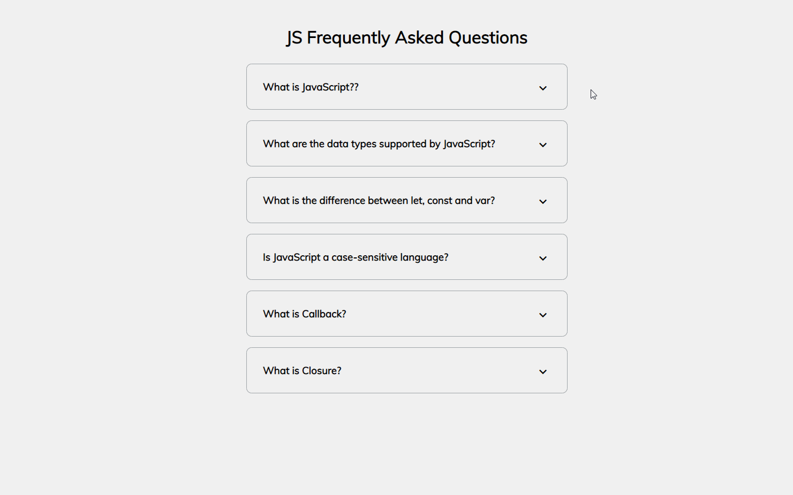

# Js Frequently Asked Questions



## 🦉 Main information

Frequently Asked Questions project that represent cards with Js questions and answers.

The project goal:
- create cards that you can expand that have questions and answers
- use Font Awesome specific Unicode for the icons in the CSS
- add JavaScript to close and open each tab to see the answer
- set up in HTML, style it with CSS and add the functionality with JavaScript

## 🦊 Useful links 

How To Toggle Class

```
https://www.w3schools.com/howto/howto_js_toggle_class.asp
```

## ⚡ Built With
[HTML5](https://www.w3schools.com/html/) / [CSS3](https://www.w3schools.com/css/) / [JavaScript](https://www.w3schools.com/js/)